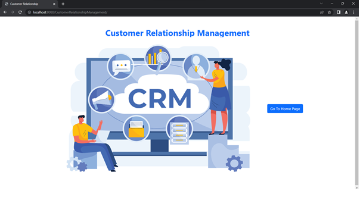
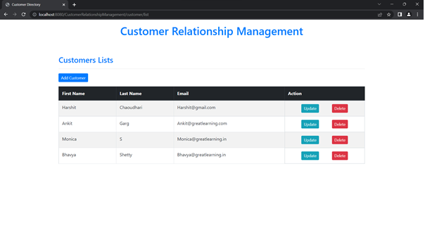
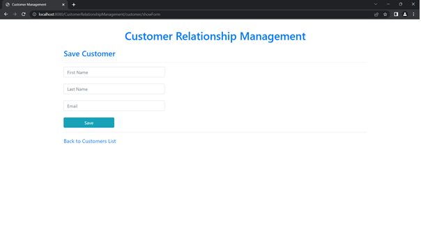
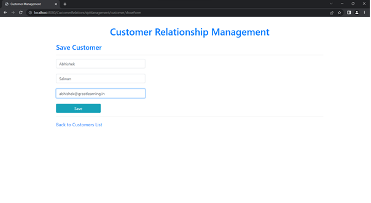
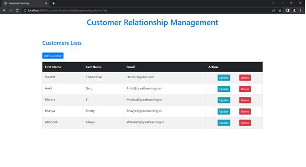
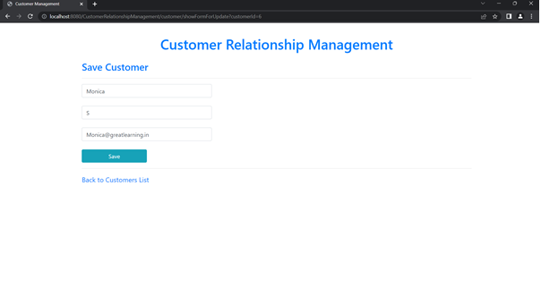
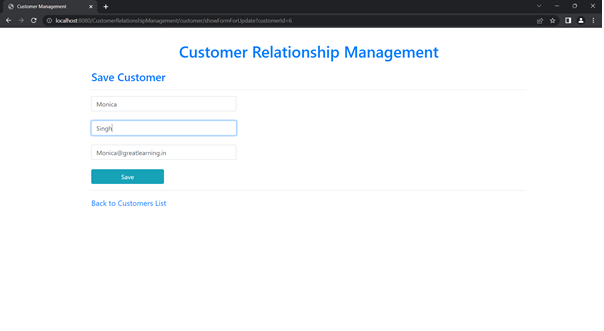
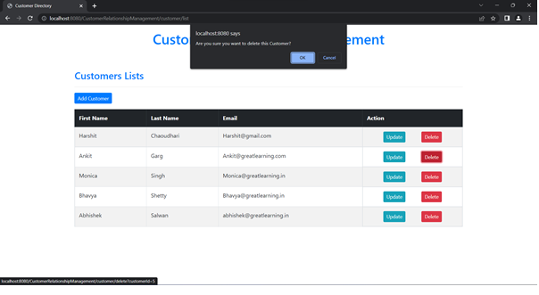

# Customer Relationship Management

These are screenshot for Project

1. Home Page of application
   

2. Customer Listing Page
   

3. Customer Form
   

4. Customer Form Filled
   

5. Customer After save List Updated
   

6. Customer Updated Form updated `Monica`
   

7. Customer Updated Form updated `Monica`last name to `Singh`
   

8. Customer Updated List updated `Monica`last name to `Singh`
   

9. Customer delete deleting Ankit Garg
   

10. Customer List after delete
    
